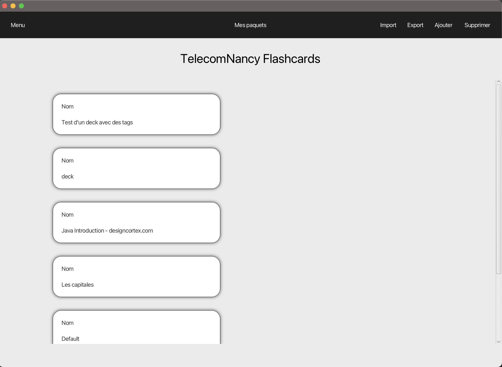
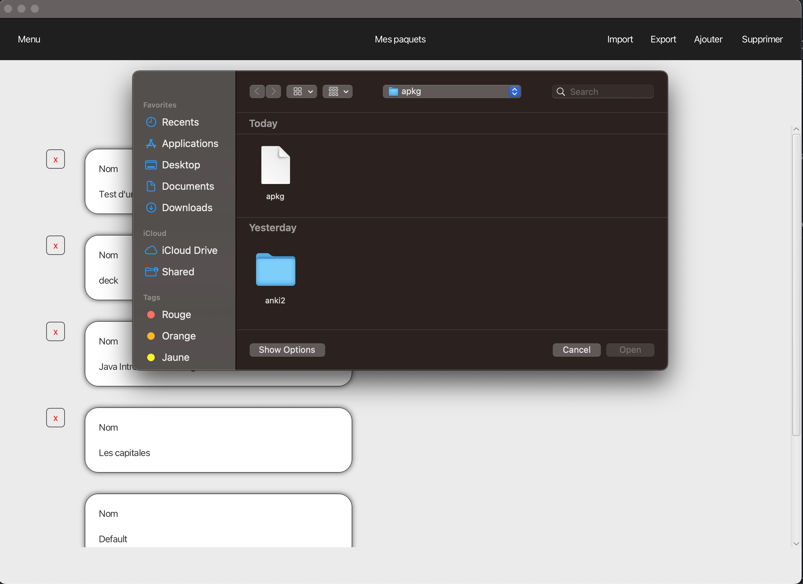
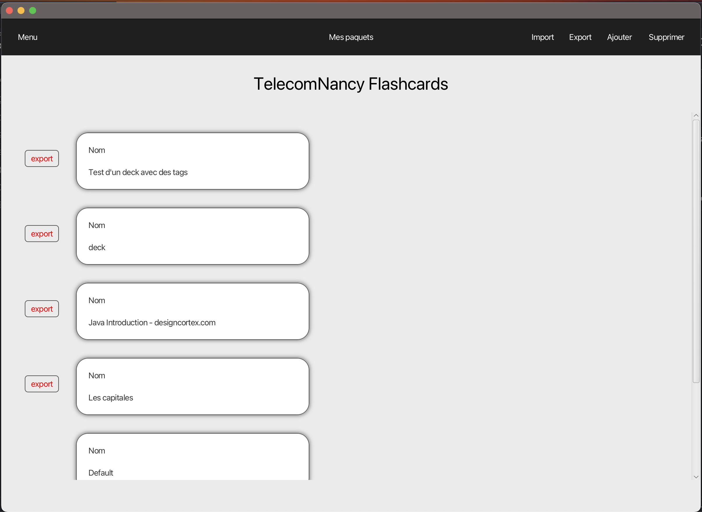
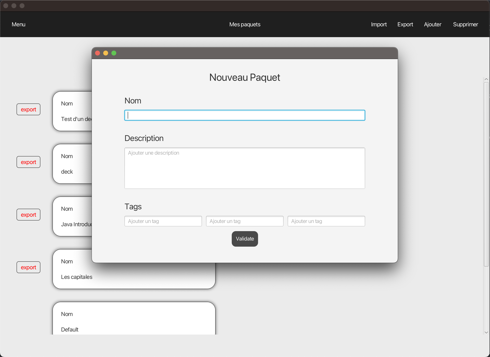
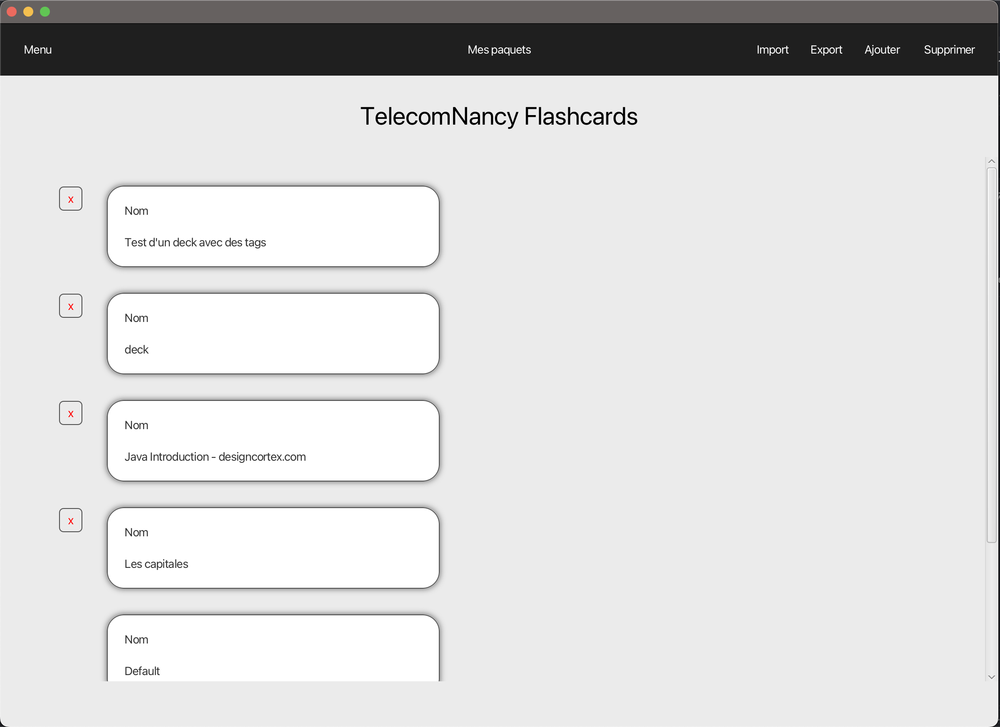
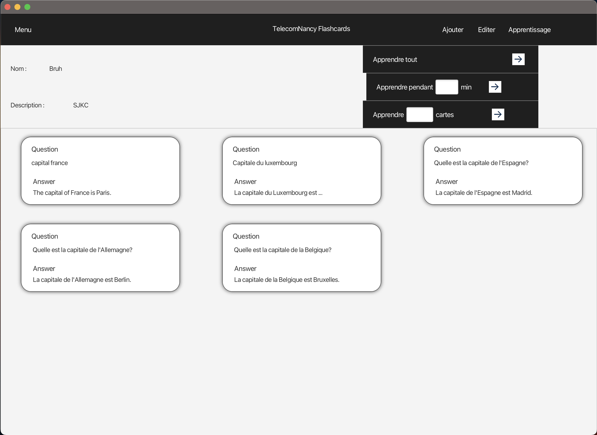

# Coding week : tisane pas d'cerne

## Execute the project

This project uses gradle. You can run it with the following command :

``` bash
./gradlew run
```

## Tutorial

Here is a little tutorial to use the application

Here is the first scene of the application where you can see all of your decks. The application save the decks when it's closed and load them automatically when it's launched.



You can import, export, create and delete decks with the buttons in the navbar at the top of the scene. Export, create and delete button will display buttons next to each deck to select on wich deck you want to perform the action. Import button will display a file chooser to select decks to import. You can either import .apkg files or .tlf files (our own representation).

Here are the different possible configuration.

 



When you double click on a deck you can see all the cards in it. You can edit them or go throught study with this deck. You can navigate throught all those functionalities with the top navbar.

When you want to start studying you can select multiple option. You can select the number of cards you want to study. The session will stop at the end of the number of cards selected and will display stats of your session. You can also select a timed version where you only have a selected amount of time to answer questions.


